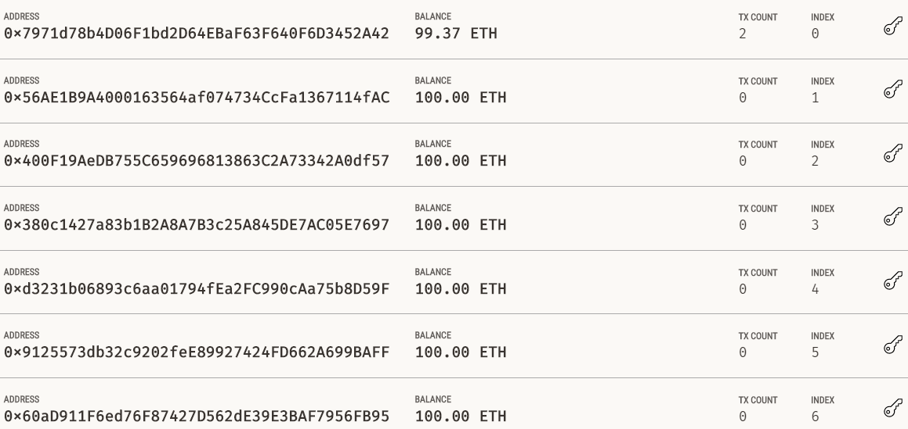
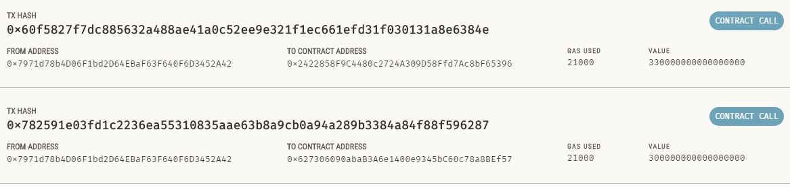

# module_19_challenge

The module 19 challenge for fintech course

The python file creates a streamlit application that lets you send ether to an employees account.

---

## Technologies

The file requires streamlit for running the program in a web browser.
The file imports pandas as well.

The files also requires a suite of install that work with ethereum and web3, installation is covered below.
Web3, pip install web3==5.17
ethereum-tester, pip install eth-tester==0.5.0b3
mnemonic, pip install mnemonic
bip44, pip install bip44

---

## Installation Guide

Other than Python 3.7, streamlit is required and the file runs in a browser, chrome works well. Launch the file by navigating to the directory of the file through a CLI and then running "streamlit run fintech_finder.py"

streamlit and the web3 suite can be installed from the CLI with the following:

pip install streamlit
Web3, pip install web3==5.17
ethereum-tester, pip install eth-tester==0.5.0b3
mnemonic, pip install mnemonic
bip44, pip install bip44

---

## Usage

The worksheet allows users to search for candidates and pay for their services.  The sheet allows the user to select a candidate and input how many hours they'd liek to pay them for.  When run the application sends their eth acocunt the appropriate payment.

---

## Contributors

Michael Canavan

---

## License

The content of the course is owned and managed by UC Berkeley Fintech Bootcamp.